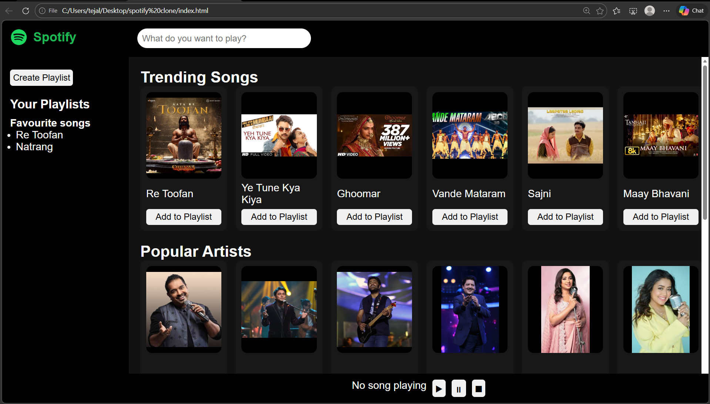

# 🎵 Spotify Clone – Playlist Manager

---

## 📌 Description  
This project is a **Spotify Clone** focused on implementing a **Playlist Manager system**, inspired by Spotify.  
It allows users to create playlists, add songs, and play them through an interactive and user-friendly interface.  
The project demonstrates the core functionality of modern music streaming applications in a simplified way.

---

## 🚀 Features  

- 🎧 Play and pause songs  
- 📂 Create playlists  
- ➕ Add songs to playlists    
- 🎨 Simple and responsive UI  

---

## 🛠️ Technologies Used  

- HTML  
- CSS  
- JavaScript 

---

## 📁 Project Structure  

Spotify-Clone/  
│── index.html                     
│── style.css                      
│── script.js                   
│── audio/              
│── images/             
│── Spotify_Clone_Case_Study/

---

## ⚙️ How It Works  

1. User opens the application  
2. Songs are displayed on the interface  
3. User can create a playlist  
4. Songs can be added to the playlist  
5. User can play songs     

---

## 🔄 Main Operation  

Playlist Management System:  
Create Playlist → Add Songs  

---

## 📚 Case Study  

The detailed written case study for this project is available here:   
👉 [Download Case Study](Spotify_Clone_Case_Study.pdf)

---

## 📸 Screenshot (Main Page)  

The following screenshot shows the main interface of the Spotify Clone application
👉 
---

## 📊 Conclusion  

The Spotify Clone Playlist Manager successfully demonstrates how songs can be organized and played efficiently.  

---
